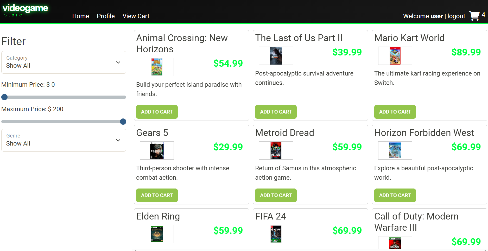
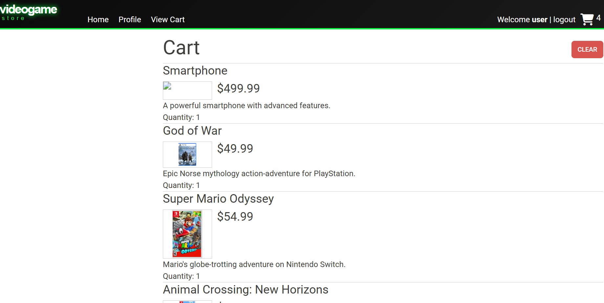
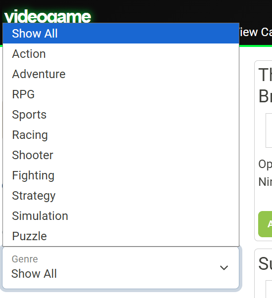

Video Game Store Api

## Description of the Project

The Video Game Store API is a Java spring boost REST API that is used for online video game store. It lets the authenticated
user to search through variety of products, manage shopping cart and place order in checkout. Admin users can manage
stores product and categories.

## User Stories

- As a user, I want to view all categories, so I can browse products by type.
- As a user, I want to view a category by ID, so I can confirm its details.
- As a user admin, I want updates to modify an existing product instead of creating a duplicate so inventory stays clean.
- As a user admin, I want to create categories so the store can add new sections.
- As a user admin, I want to update a category so I can fix names/descriptions
- As a user admin, I want to delete a category so I can remove outdated sections.
- As a user, I want to browse all products so I can choose items to buy.
- As a user, I want product details so I can decide to purchase.
- As a user admin, I want to remove products so customers can’t buy discontinued items.
- As a user, I want to filter products by category, price range, and subCategory, so I can find what I want quickly.
- As a user admin, I want to add products so the store can sell new items.

## Setup

Instructions on how to set up and run the project using IntelliJ IDEA.

### Prerequisites

- IntelliJ IDEA: Ensure you have IntelliJ IDEA installed, which you can download from [here](https://www.jetbrains.com/idea/download/).
- Java SDK: Make sure Java SDK is installed and configured in IntelliJ.

### Running the Application in IntelliJ

Follow these steps to get your application running within IntelliJ IDEA:

1. Open IntelliJ IDEA.
2. Select "Open" and navigate to the directory where you cloned or downloaded the project.
3. After the project opens, wait for IntelliJ to index the files and set up the project.
4. Find the main class with the `public static void main(String[] args)` method.
5. Right-click on the file and select 'Run 'YourMainClassName.main()'' to start the application.

## Technologies Used

- Java:JDK 17
- Sprint Boost
- Insomnia
- Github
- MySQL Workbench

## Demo

## Future Work

Outline potential future enhancements or functionalities you might consider adding:

- Additional feature to be developed.
- Improvement of current functionalities.

## Resources

List resources such as tutorials, articles, or documentation that helped you during the project.

- [Java Programming Tutorial](https://www.example.com)
- [Effective Java](https://www.example.com)

## Team Members

- **Name 1** - Specific contributions or roles.
- **Name 2** - Specific contributions or roles.

## Thanks

Express gratitude towards those who provided help, guidance, or resources:

- Thank you to [Mentor's Name] for continuous support and guidance.
- A special thanks to all teammates for their dedication and teamwork.
